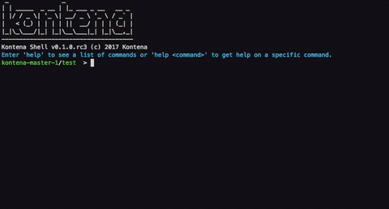

# Kontena Shell

[](https://travis-ci.org/kontena/kontena-plugin-shell)
[](https://slack.kontena.io)
[](https://gitter.im/kontena/kontena?utm_source=badge&utm_medium=badge&utm_campaign=pr-badge&utm_content=badge)

[](https://asciinema.org/a/58j375bs9zqn3x33wsir7drsa)

Kontena Shell, or KOSH for short, is an interactive console interface for the [Kontena CLI](https://github.com/kontena/kontena).

Features:

- Command context switching, for example jump to stack context and use `ls` and `install` instead of `kontena stack ls` and `kontena stack install`
- Prompt shows current master and grid
- Command history
- Batch commands
- Tab completion
- ...

## Installation

```console
$ kontena plugin install shell
```

## Usage

Starting the console:

```console
$ kontena shell
```

or:

```console
$ kosh
```

You can enter regular Kontena CLI subcommands without `kontena`:

```batch
kontena-master/grid-name > master ls
Name                     Url
kontena-master           http://192.168.66.100:8080
```

Or enter a command context:

```batch
kontena-master/grid-name > grid
kontena-master/grid-name grid > ls
Name                           Nodes    Services     Users
grid-name *                    2        1            1
test                           0        0            2
```

To go up in the context, use `..`:

```batch
kontena-master/foo grid > ..
kontena-master/foo > _
```

Or go to top with `/`:

```batch
kontena-master/foo > master user
kontena-master/foo master user > /
kontena-master/foo > _
```

Or run commands from another context:

```batch
kontena-master/foo master user > / grid ls
Name                           Nodes    Services     Users
grid-name *                    2        1            1
kontena-master/foo master user > _
```

Use `help` to see help:

```batch
kontena-master/foo grid > help
Usage:
      SUBCOMMAND [ARG] ...

Parameters:
    SUBCOMMAND                    subcommand
    [ARG] ...                     subcommand arguments
...
```

## Contributing

1. Fork it ( https://github.com/kontena/kontena-plugin-shell )
2. Create your feature branch (`git checkout -b my-new-feature`)
3. Commit your changes (`git commit -am 'Add some feature'`)
4. Push to the branch (`git push origin my-new-feature`)
5. Create a new Pull Request

## License

Kontena Shell Plugin is licensed under the Apache License, Version 2.0. See [LICENSE](LICENSE.txt) for full license text.
